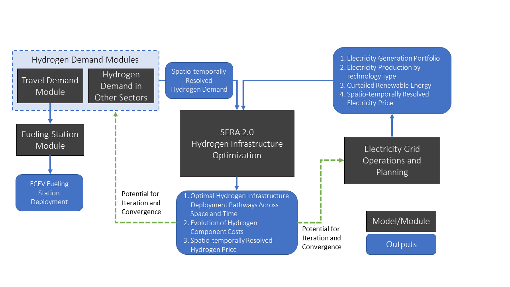

# SERA.jl
SERA in Julia Programming Language

## Model Purpose
The SERA 2.0 framework in Julia will be designed to interact with models of other sectors including the transportation and 
electricity grid. This vision is summarized in the flow diagram below.

## How to run SERA in Julia
Example files for running Julia SERA are contained in sub-directories of examples directory.

## Julia Package Requirements
SERA requires a number of packages to run correctly. Most come with the standard installation of Julia, but please ensure the following non-standard packages are installed: \
`Pkg.add("CSV","YAML","DataFrames","DataFramesMeta","JuMP","GLPK","Ipopt")`

### File Updates Required
For each test case you would like to run, two files must be updated to the correct working directory: 
- update the `setup.jl` file line 2 must be updated to include your current working directory
- the test file (e.g. `example_test_storage.jl`) line 14 also must be updated to your current working directory

### Mac OS
For test-case-1, corresponding to simplest test case with storage,\
the example file is examples/example_test_storage/example_test_storage.jl.\
To run this example, cd to examples/example_test_storage, modify the setup.jl file\
to set the appropriate working directory, and run the following command\
`julia example_test_storage.jl > example_test_storage.log`

For Texas with storage, the example file is examples/example-5/example-5.jl.\
To run this example, cd to examples/example-5, modify the setup.jl file\
to set the appropriate working directory, and run the following command\
`julia example-5.jl > example-5.log`

### Windows OS
- locate your julia exe file (typically something like: `C:\Users\[UserName]\AppData\Local\Julia-1.2.0\bin\julia.exe`)
- open the command line terminal
- navigate to the working directory that the test file is located in (e.g. `cd C:\Users\[UserName]\Documents\SERA.jl\examples\example_test_storage\`)
- at the terminal prompt, enter: (1) the julia exe file location, (2) the .jl file name that you want to run, and (3) the output file name (e.g. `C:\Users\[UserName]\AppData\Local\Julia-1.2.0\bin\julia.exe example_test_storage.jl > output.log`)
